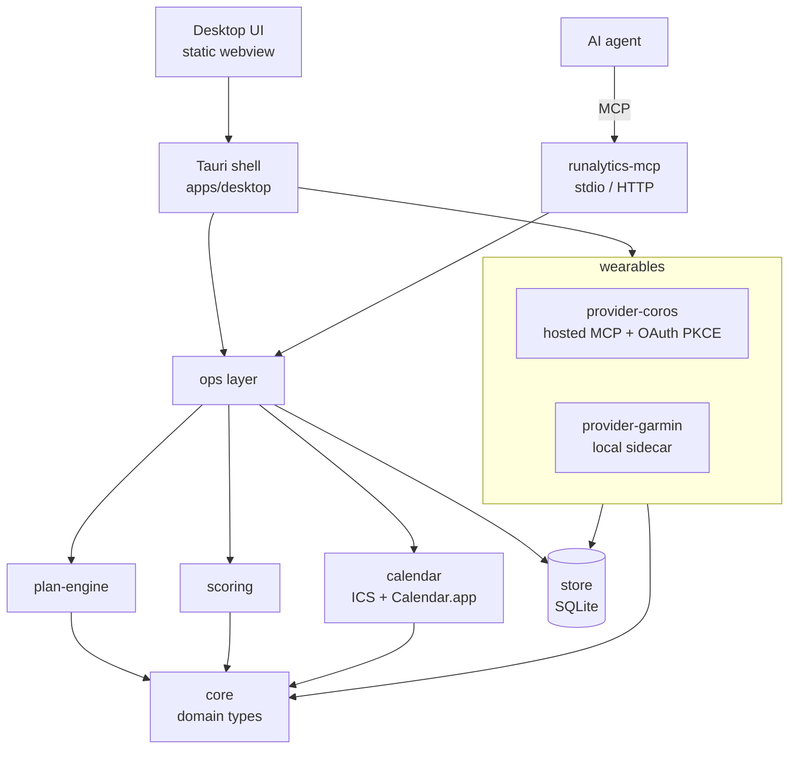

# Runalytics

Runalytics is a macOS app that turns wearable data into an adaptive running
plan. It syncs your training and health data from a watch, scores every day for
readiness and injury risk, generates a goal-driven plan, keeps it on your
calendar, and exposes the whole thing to an AI coach over the Model Context
Protocol (MCP) so an agent can reshape the plan in plain language.

> Status: functional vertical slice. COROS is the first wearable; the desktop
> app, the MCP server, and the full plan/score/calendar pipeline are in place.
> The bundle is not yet Apple-notarized (first launch uses the macOS
> *Open Anyway* flow).

## What it does

- **Plans** — generate a `marathon`, `half_marathon`, `ten_k`, `five_k`,
  `recovery`, or `maintain` plan over a horizon (≤ 10 weeks) or to a fixed race
  date. Plans are deterministic and editable session by session.
- **Scores** — every day gets a readiness score, an injury-risk score, a
  training load, and (per run) a session-quality score, computed from the
  training plan plus wearable health and activity data.
- **Calendar** — the active plan is published to Calendar.app (via AppleScript)
  and as an ICS feed, keyed so a re-sync moves sessions instead of duplicating
  them.
- **Agent coaching** — the same operations are tools on an MCP server, so an
  agent (GitHub Copilot, Claude, …) can plan, adjust, and interpret runs. See
  [`SKILL.md`](SKILL.md) for the `runalytics-coach` contract.

## Architecture

The app is a thin Tauri shell over a layered Rust core. The desktop UI, the CLI,
and any MCP agent all go through one `ops` layer and one SQLite database, so they
never diverge.



### Crates

| Crate | Responsibility |
| --- | --- |
| [`core`](crates/core) | Domain types: plans, sessions, scores, athlete, units. No I/O. |
| [`store`](crates/store) | SQLite schema, migrations, and typed repositories. |
| [`plan-engine`](crates/plan-engine) | Deterministic plan generation from a goal + anchor. |
| [`scoring`](crates/scoring) | Readiness, injury risk, session quality, load, performance. |
| [`calendar`](crates/calendar) | ICS rendering and calendar sinks (Calendar.app, file). |
| [`provider-core`](crates/provider-core) | The wearable adapter contract + the resumable ingest pipeline. |
| [`provider-coros`](crates/provider-coros) | COROS adapter (hosted MCP client, OAuth 2.1 + PKCE). |
| [`provider-garmin`](crates/provider-garmin) | Garmin adapter over a local community MCP sidecar. |
| [`mcp`](crates/mcp) | The `runalytics-mcp` server: plan/score/calendar tools for agents. |
| [`apps/desktop`](apps/desktop) | Tauri shell: commands, provider consent, sync, tray. |

## Build & run

Requires the stable Rust toolchain (see [`rust-toolchain.toml`](rust-toolchain.toml))
on macOS 12+.

```sh
make check      # fmt + clippy + test — the full CI gate, run locally
make dev        # run the desktop app in debug
make mcp        # build the MCP server (release)
make bundle     # build the macOS .app (installs the Tauri CLI via `make tools`)
make help       # list every target
```

CI ([`.github/workflows/ci.yml`](.github/workflows/ci.yml)) runs the same
`make` targets, so a branch that passes `make check` locally is green there.

## Using it as an agent tool

The MCP server speaks stdio by default, or HTTP on a loopback port:

```sh
runalytics-mcp --db ~/Library/Application\ Support/io.runalytics.desktop/runalytics.db
runalytics-mcp --db <path> --http 7437      # streamable HTTP on 127.0.0.1:7437
```

Point it at the same database the desktop app uses and the agent sees your live
plan and scores. Flags: `--db` (or `RUNALYTICS_DB`), `--tz` (default
`Europe/Berlin`), `--calendar-name`, `--ics-path`, `--http`.

## License

MIT — see [`LICENSE`](LICENSE).
